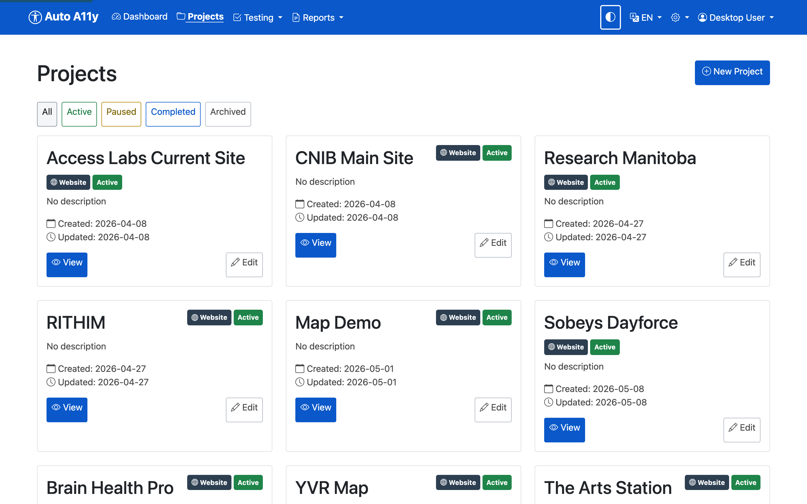

# Auto A11y User Guide

Auto A11y is a web accessibility testing platform. It crawls websites, runs
hundreds of automated WCAG checks in a real browser, adds AI-powered visual
analysis, and produces reports ranging from a one-page executive summary to a
complete offline audit package.

This guide walks through the desktop application using a real example project
— **Inaccessibility Matters**, a deliberately inaccessible demonstration site
— so every screenshot shows genuine test data.

## Contents

1. [How Auto A11y works](#how-auto-a11y-works)
2. [The Dashboard](#the-dashboard)
3. [Projects](#projects)
4. [Websites and page discovery](#websites-and-page-discovery)
5. [Running tests](#running-tests)
6. [Reading test results](#reading-test-results)
7. [Reports](#reports)
8. [Scheduling recurring tests](#scheduling-recurring-tests)
9. [The Testing menu](#the-testing-menu)
10. [Tips, accessibility features, and troubleshooting](#tips-accessibility-features-and-troubleshooting)

---

## How Auto A11y works

The workflow is a loop: set up a project, find the pages, test them, review
what was found, report — then fix the site and re-test to track progress.

Everything you test lives in a simple hierarchy: a **project** contains
**websites**, each website contains **pages**, and every page keeps its own
history of **test results**. Two engines find the issues:

Issues are graded by **severity**:

| Severity | Meaning |
| --- | --- |
| **Error** | A WCAG violation that must be fixed |
| **Warning** | A likely barrier that should be reviewed |
| **Info** | Worth noting; not necessarily a defect |
| **Discovery** | Content the automation found that needs *manual* review (forms, videos, PDFs, complex widgets) |

and organized by **touchpoint** — the category of accessibility concern
(Forms, Headings, Landmarks, Colors and Contrast, Focus Management, and so
on). Touchpoints map to the relevant WCAG success criteria in every report.

A quality gate protects you from false positives: each automated check is
validated against a library of known test cases ("fixtures"), and **only
checks that pass all of their fixtures are enabled**. You can see exactly
which checks are active under *Testing → Fixture Status*.

## The Dashboard

The Dashboard is the landing page: portfolio-wide statistics, quick actions,
test coverage, and system status.

- **Stat tiles** — totals across all projects: pages, tested pages, and
  issues broken down by severity.
- **Quick Actions** — jump straight to creating a project, running tests, or
  generating a report.
- **Test Coverage** — how much of your page inventory has been tested.
- **System Status** — the database, browser engine, and AI analysis must all
  be green for testing to run.

The top navigation is always available: **Dashboard**, **Projects**,
**Testing** (dashboard, configuration, fixture status, trends), and
**Reports**, plus the dark-mode toggle, language switcher (English/French),
and settings on the right.

## Projects

A project is the container for one audit engagement — its websites, test
settings, WCAG level, and reports. Open **Projects** in the navigation to see
your project list.

### Creating a project

Click **New Project**. Only the name is required; the form also lets you set
a description, project type, and compliance settings (such as the target
WCAG level).

Note the banner at the top: it is a reminder that only fixture-validated
checks will run, with a link to the current fixture status.

### The project page

Opening a project shows everything in one place:

- **Test All Websites** starts a test run over every website in the project.
- **Automated Tests** lets you choose which checks run for this project.
- The **Websites** card lists each site with its issue counts and per-site
  **View / Discover / Test** buttons.

## Websites and page discovery

Open a website from the project page to manage its pages and testing.

### Finding pages

There are three ways to build the page inventory:

1. **Discover Pages** — crawls the site automatically, following links to
   find pages. Discovery runs in the background; **Discovery History** shows
   past crawls.
2. **Add Page** — add a URL by hand (useful for pages the crawler can't
   reach).
3. **Manual mode** — opens a *visible* Chromium window that you drive
   yourself. Navigate wherever you need — through logins, wizards, or
   dynamic states — then click **Capture this page** to add the current URL
   to the page list, or **Test this page** to run the test suite against
   exactly what is on screen.

The **Pages** list shows every page with its status (tested/untested), latest
issue counts, and per-page actions.

### Testing behind logins and complex states

Two supporting tools live on the website page:

- **Test Users** — stored login credentials. When configured, the test
  runner signs in as that user before testing, so authenticated pages can be
  audited. A "test login" button verifies the automation works.
- **Setup Scripts** — recorded actions to run before testing a page (dismiss
  a cookie banner, open a menu, switch a tab), so tests measure the state
  that matters.

## Running tests

You can start a test at any scope:

| Where | Button | What runs |
| --- | --- | --- |
| Project page | **Test All Websites** | Every page in every website |
| Website page | **Test All Documents** | Every page (and PDF) in the site |
| Website page | **Test Untested Documents** | Only pages without results |
| Page list / page view | **Test** | That single page |

During a test, Auto A11y loads the page in a browser, injects and runs the
JavaScript check suite, captures a screenshot, and (when enabled) sends the
screenshot to Claude AI for visual analysis — catching issues DOM inspection
cannot see, such as reading order, visual headings that aren't marked up, and
motion without pause controls. Results are saved to the page's history.

Tests run as background jobs; you can keep working while they run. Progress
is visible on the page itself and under *Testing → Dashboard*.

## Reading test results

Open any tested page to see its **Latest Test Results** — the heart of the
product. Issues are grouped into severity sections (Errors, Warnings, Info,
Discovery), then by touchpoint, then by issue type.

Each issue row shows its **impact** (High/Medium/Low), the **user context**
it was tested under (e.g. Guest), a plain-language description, and the
**XPath** locating the element. Issues with multiple occurrences group their
instances. Expand a row for the full detail:

Inside an expanded issue you'll find:

- **What the issue is / Why it matters / Who it affects** — plain-language
  explanations suitable for sharing with content owners.
- **How to remediate** — concrete fix guidance.
- **WCAG success criteria** — with links to the W3C *Understanding* and
  *How to Meet* pages.
- **Location** — the XPath, with a copy button.
- **Code snippet** — the offending HTML.
- **Page thumbnail** — the page as it looked at test time.

Every page keeps a **Test History** table below the latest results, so you
can compare runs over time as fixes land.

## Reports

Open **Reports** in the navigation. Six report types cover different
audiences and purposes; all generate in the background and appear under
*Recent Reports* when complete.

### Accessibility Report

*Audience: managers and stakeholders. The executive overview.*

A structured summary of a project's (or website's) accessibility state:
compliance score with letter grade, key metrics, issues by touchpoint and by
impact, the most frequent issues, prioritized recommendations, and an
**AI Executive Analysis** — an assessment written by Claude AI covering
strengths, critical risks, maturity level, user impact by disability group,
legal risk, and a phased remediation strategy.

Available formats: **HTML** (shown below), **Excel**, **CSV**, **JSON**, and
**PDF**.

The **Excel** format is the working spreadsheet: an executive summary sheet
plus per-website sheets and a complete issue list with descriptions, WCAG
criteria, XPaths, and remediation guidance — ideal for tracking fixes.

### Discovery Report

*Audience: auditors planning manual review.*

Lists the content that automated testing **cannot** judge — forms, videos,
PDFs, unusual typography, elements with questionable accessible names — so a
human reviewer knows exactly where to look. Site-wide issues (appearing on
most pages) are separated from page-specific ones so global components get
fixed once. Formats: HTML or PDF.

### Site Structure

*Audience: anyone needing to understand the site's shape.*

A hierarchical tree of the website's organization as discovered by the
crawler — useful for scoping an audit and spotting orphaned sections.

### Offline Report (Static HTML)

*Audience: clients and teams without access to the app.*

A complete, self-contained **multi-page website** delivered as a ZIP: an
index of all tested pages with scores and client-side search/filtering, a
summary page with statistics, and a full detail page per tested page with
the same issue accordions as the app. Everything — CSS, JavaScript, images,
screenshots — is bundled, so it works from a file share or email attachment
with no server and no internet. Bilingual: every page has an EN/FR switcher.

Options when generating: choose project or single website scope, WCAG level,
and whether to include screenshots and discovery items.

### Deduplicated Offline Report

*Audience: developers fixing a template-based site.*

The same offline ZIP concept, but issues are **grouped by common component**
— the header, navigation, and footer that repeat on every page are reported
once, with the pages they affect, instead of once per page. Scores are shown
both for the full page and excluding component issues, so you can see how
much a single template fix will move the needle. Also bilingual.

### Recordings Report

*Audience: teams complementing automation with lived experience.*

Compiles findings from **recorded manual testing sessions** — audio-recorded
walkthroughs by testers with disabilities, uploaded to the project — into an
audit document: user quotes with timecodes, pain points, and key takeaways,
alongside the structured issues raised. (This example uses the YVR Map
project, which has recorded sessions.)

### Generating and downloading

Every report generates as a background job — large reports can take several
minutes. Finished reports appear in **Recent Reports** at the bottom of the
Reports page with a download button; failed jobs can be restarted, and
running jobs can be dropped.

## Scheduling recurring tests

*Reports → Schedules* (or the Schedules button on a website page) lets you
run tests automatically — daily, weekly, or monthly — so trend data
accumulates without anyone remembering to click Test.

## The Testing menu

- **Dashboard** — live and recent test activity across all projects.
- **Configure** — runtime testing options.
- **Fixture Status** — the quality gate: every check in the test suite with
  its validation state. Only checks passing all fixtures run in production.

  

- **Trends** — violation and warning counts over time, so you can show
  progress between audits.

  

## Tips, accessibility features, and troubleshooting

**The app practices what it audits.** The interface meets WCAG 2.2 AA: full
keyboard operation (expanded accordions draw a double-line focus ring around
the entire issue), dark mode via the toggle in the navigation bar, a full
French translation via the EN/FR switcher, and screen-reader-tested
components.

**A page loads in the browser but the test reports "Failed to load page".**
Usually the page never finishes loading its network activity (hung
third-party images, long-polling scripts). Auto A11y tolerates this — it
tests the loaded DOM after a grace period — but a page that cannot even
reach *domcontentloaded* within 30 seconds will fail. Check the URL is
reachable from this machine.

**A check you expected didn't run.** See *Testing → Fixture Status* — the
check may be disabled because it has not passed all of its validation
fixtures.

**Report generation seems stuck.** Reports over large sites take minutes.
The Reports page shows job progress; a stalled job can be dropped and
restarted from *Recent Reports*.

**AI analysis findings are missing.** AI visual analysis requires an
API key and the *AI Analysis: Enabled* status on the Dashboard. Automated
DOM checks run regardless.

**The numbers in this guide look alarming.** They should — *Inaccessibility
Matters* is a demonstration site built to fail. A 1.0% compliance score is
the point.

---

*See also: [API_GUIDE.md](API_GUIDE.md) for automating Auto A11y from
scripts and CI, and [ARCHITECTURE.md](ARCHITECTURE.md) for how the platform
works internally.*
