# Auto A11y User Guide

Auto A11y is a web accessibility testing platform. It crawls websites, runs
hundreds of automated WCAG checks in a real browser, adds AI-powered visual
analysis, tests PDFs, and produces reports ranging from a one-page executive
summary to a complete offline audit package.

This guide walks through the desktop application using a real example project
— **Inaccessibility Matters**, a deliberately inaccessible demonstration site
— so every screenshot shows genuine test data.

## Contents

1. [An introduction to accessibility testing](#1-an-introduction-to-accessibility-testing)
2. [How Auto A11y works](#2-how-auto-a11y-works)
3. [The Dashboard](#3-the-dashboard)
4. [Creating and configuring a project](#4-creating-and-configuring-a-project)
5. [Choosing which tests to run](#5-choosing-which-tests-to-run)
6. [Automated checks versus AI analysis](#6-automated-checks-versus-ai-analysis)
7. [Responsive breakpoint testing](#7-responsive-breakpoint-testing)
8. [Websites and page discovery](#8-websites-and-page-discovery)
9. [Cloaking: getting past bot protection](#9-cloaking-getting-past-bot-protection)
10. [Test users: content behind logins](#10-test-users-content-behind-logins)
11. [Setup scripts and multi-state testing](#11-setup-scripts-and-multi-state-testing)
12. [Running tests](#12-running-tests)
13. [Reading test results](#13-reading-test-results)
14. [Testing PDFs](#14-testing-pdfs)
15. [Reports](#15-reports)
16. [Scheduling recurring tests](#16-scheduling-recurring-tests)
17. [The Testing menu](#17-the-testing-menu)
18. [Tips, accessibility features, and troubleshooting](#18-tips-accessibility-features-and-troubleshooting)
19. [Appendix A: Tests by touchpoint](#19-appendix-a-tests-by-touchpoint)

---

## 1. An introduction to accessibility testing

**Web accessibility** means building websites that everyone can use,
including people who are blind or have low vision, are deaf or hard of
hearing, have motor impairments that make a mouse difficult, or have
cognitive disabilities. The international standard is the **Web Content
Accessibility Guidelines (WCAG)**, organized into success criteria at three
conformance levels: A, AA (the common legal target), and AAA.

No single technique catches every accessibility barrier. Auto A11y combines
several complementary kinds of testing, and understanding what each can and
cannot do is the key to using the tool well.

- **Automated DOM testing.** Hundreds of programmatic checks run against the
  page's structure in a real browser — missing alt text, form fields with no
  label, invalid ARIA, heading levels that skip. This is fast, exact, and
  repeatable, but it can only find problems a machine can be *certain* about.
  It cannot tell you whether alt text is *meaningful*, only whether it
  exists.

- **AI visual analysis.** Some barriers are only visible in the rendered
  page: text that *looks* like a heading but isn't marked up as one, a
  reading order that doesn't match the visual layout, an animation with no
  pause control. Auto A11y sends page screenshots to Claude AI to catch these
  — judgment calls that DOM inspection structurally cannot make.

- **Manual review (Discovery).** Some things a tool can only *flag* for a
  human to judge: does this video have accurate captions? Is this form's
  error handling clear? Auto A11y surfaces these as **Discovery** items and
  collects them in a dedicated report so a human reviewer knows exactly where
  to look.

- **Lived-experience testing.** The ultimate test is a person with a
  disability using the site. Auto A11y can ingest recordings of these
  sessions and compile their findings alongside the automated results.

- **Document testing.** Accessibility doesn't stop at HTML. Auto A11y audits
  **PDF** documents against PDF/UA and WCAG.

A complete audit uses all of these. Automated testing tells you *where* the
obvious problems are and gives you a baseline to track over time; AI and
manual review find what automation misses; lived experience confirms whether
the site actually works for real users. This guide covers each part.

> **Why the tool won't give you a "100% accessible" stamp.** Automated
> testing can prove a site *fails*, but it can never prove a site *passes* —
> roughly half of WCAG criteria require human judgment. A clean automated
> result means "no machine-detectable violations," which is necessary but not
> sufficient. Treat the score as a floor, not a certificate.

## 2. How Auto A11y works

The workflow is a loop: set up a project, find the pages, test them, review
what was found, report — then fix the site and re-test to track progress.

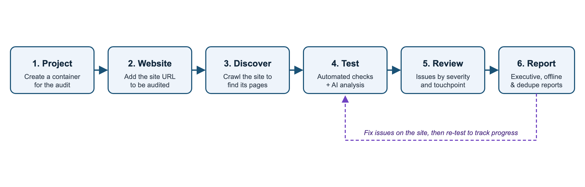

Everything you test lives in a simple hierarchy: a **project** contains
**websites**, each website contains **pages** (and PDFs), and every page
keeps its own history of **test results**.

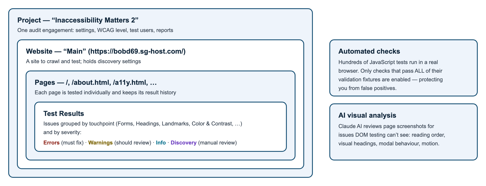

Issues are graded by **severity**:

| Severity | Meaning |
| --- | --- |
| **Error** | A WCAG violation that must be fixed |
| **Warning** | A likely barrier that should be reviewed |
| **Info** | Worth noting; not necessarily a defect |
| **Discovery** | Content the automation found that needs *manual* review (forms, videos, PDFs, complex widgets) |

and organized by **touchpoint** — the category of accessibility concern
(Forms, Headings, Landmarks, Colors and Contrast, Focus Management, and so
on). Touchpoints map to the relevant WCAG success criteria in every report,
and they are also how you choose what to test (see
[section 5](#5-choosing-which-tests-to-run)).

A quality gate protects you from false positives: each automated check is
validated against a library of known test cases ("fixtures"), and **only
checks that pass all of their fixtures are enabled**. You can see exactly
which checks are active under *Testing → Fixture Status*, and the full list
is in [Appendix A](#19-appendix-a-tests-by-touchpoint).

## 3. The Dashboard

The Dashboard is the landing page: portfolio-wide statistics, quick actions,
test coverage, and system status.

- **Stat tiles** — totals across all projects: pages, tested pages, and
  issues broken down by severity.
- **Quick Actions** — jump straight to creating a project, running tests, or
  generating a report.
- **Test Coverage** — how much of your page inventory has been tested.
- **System Status** — the database, browser engine, and AI analysis must all
  be green for testing to run.

The top navigation is always available: **Dashboard**, **Projects**,
**Testing** (dashboard, configuration, fixture status, trends), and
**Reports**, plus the dark-mode toggle, language switcher (English/French),
and settings on the right.

## 4. Creating and configuring a project

A project is the container for one audit engagement — its websites, test
settings, WCAG level, test users, and reports. From **Projects** in the
navigation, click **New Project**.

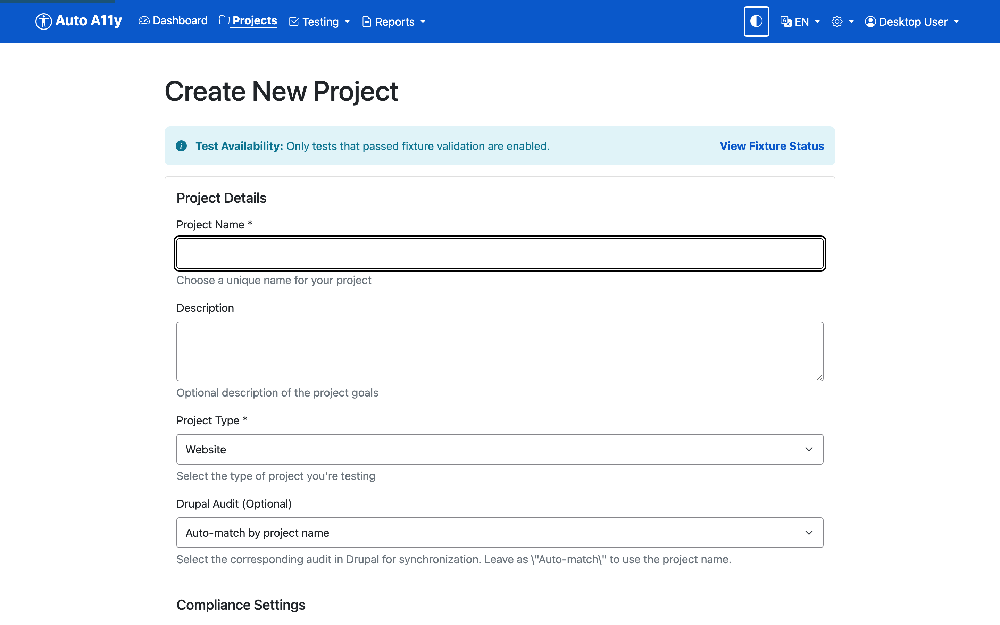

The form is longer than it first appears — scroll down and you configure the
entire testing behaviour for the project up front:

- **Project Name** (required) and **Description**.
- **Project Type** — Website is the default.
- **Compliance Settings** — the **WCAG level** you're testing against (A, AA,
  or AAA). AA is the usual target.
- **Inaccessible Fonts** — the tool flags hard-to-read fonts. You can use the
  research-backed default list of 50+ problematic fonts (Comic Sans, Papyrus,
  narrow and blackletter faces), add your own, or exclude specific fonts your
  brand requires.
- **Browser Display Mode** — Headless (invisible, faster) or Visible (shows
  the Chrome window, useful for debugging).
- **Stealth Mode** — for bot-protected sites (see
  [section 9](#9-cloaking-getting-past-bot-protection)).
- **Touchpoint Tests** — exactly which checks run (see
  [section 5](#5-choosing-which-tests-to-run)).
- **AI-Assisted Testing** — the optional Claude analysis (see
  [section 6](#6-automated-checks-versus-ai-analysis)).

Every setting here can be changed later by opening the project and clicking
**Edit**, or, for the test selection specifically, **Automated Tests**.

### The project page

Once created, opening a project shows everything in one place:

- **Test All Websites** starts a test run over every website in the project.
- **Test Users** manages logins for authenticated testing
  ([section 10](#10-test-users-content-behind-logins)).
- **Automated Tests** re-opens the touchpoint/test selection.
- The **Websites** card lists each site with its issue counts and per-site
  **View / Discover / Test** buttons.

## 5. Choosing which tests to run

You rarely want *every* check on *every* project. A marketing site has no
data tables; an internal tool may not care about some discovery notices.
Auto A11y lets you choose what runs at two levels of granularity: the
**touchpoint** (a whole category) and the **individual test** within it.

In the project form (or via **Automated Tests** / **Edit** later), the
**Touchpoint Tests** section presents a tree. Each touchpoint is a folder you
can expand to reveal its individual checks; each check has its own checkbox.

- **The number badge** on each touchpoint shows how many checks it contains.
- **Uncheck a touchpoint** to skip the whole category; **expand it** and
  uncheck individual tests to fine-tune.
- **The help button** (question mark) next to each test opens a description of
  what it checks and why.
- **Presets** save time: **Enable All**, **Disable All**, **Minimal** (a core
  subset), and **WCAG AA** (everything needed for AA conformance).

Checks that haven't passed fixture validation appear disabled with a status
badge — they can't be enabled because they aren't trusted for production yet.
The complete catalog of checks, grouped by touchpoint, is in
[Appendix A](#19-appendix-a-tests-by-touchpoint).

## 6. Automated checks versus AI analysis

Auto A11y has two independent testing engines, and the difference between
them matters for both cost and interpretation.

**Automated (default) checks** are deterministic. They run JavaScript against
the page in a real browser and apply exact rules: this input has no label,
this image has no alt attribute, these two colors fall below the contrast
threshold. Given the same page, they return the same result every time. They
are free to run, fast, and form the backbone of every test.

**AI-assisted checks** send page screenshots and HTML to Claude AI for
analysis that requires visual judgment. Six analyses are available:

| AI check | What it looks for |
| --- | --- |
| **Heading analysis** | Text that looks like a heading but isn't marked up as one |
| **Reading order** | Whether the DOM order matches the visual reading sequence |
| **Modal dialogs** | Popup and overlay accessibility (focus, dismissal) |
| **Language** | Mixed languages and missing language declarations |
| **Animations** | Motion that may need a pause/stop control |
| **Interactive elements** | Buttons, links, and controls that look interactive but aren't properly coded |

AI testing is **off by default** and enabled per project with the
**AI-Assisted Testing** toggle, where you also pick which of the six analyses
to run.

Two things to understand before you rely on it:

> **AI testing costs money.** Each AI analysis makes an API call to Claude
> that is billed by usage. The more pages you test and the more AI checks you
> enable, the higher the cost. Automated DOM checks have no such cost — enable
> AI deliberately, not by default.

And, just as importantly:

> **AI results are stochastic.** Unlike the deterministic automated checks, an
> AI model can return slightly different results on different runs of the same
> page, and it can occasionally be wrong — a missed issue, or a flagged
> "issue" that isn't one. This is inherent to how large language models work,
> even with the prompting and validation Auto A11y applies. Treat AI findings
> as expert suggestions to verify, not as ground truth. The automated checks
> remain your reliable, repeatable baseline.

Used together they're complementary: the automated engine gives you a solid,
repeatable foundation, and AI extends coverage into areas no rule-based tool
can reach — as long as you remember which is which.

## 7. Responsive breakpoint testing

Modern sites change layout at different screen widths using CSS "media
queries" — the point where the layout changes is a **breakpoint**. An issue
can exist at one width and not another: text that has good contrast on
desktop may sit on a different background colour once the mobile layout
kicks in; a floating element may overlap content only when the viewport is
narrow.

For the checks where width matters — **colour contrast**, **floating/obscured
content**, and some **page-level** checks — Auto A11y doesn't just test once.
It reads the breakpoints declared in the page's own CSS, then re-runs the
check at **each** of those widths, so a contrast failure that only appears in
the tablet layout is still caught. In the results, these issues are labelled
with the specific breakpoint (e.g. "Breakpoint 768px") so you know exactly
which layout to fix.

Checks where width is irrelevant (a missing alt attribute is missing at every
width) run once, so this adds testing time only where it actually buys
coverage.

## 8. Websites and page discovery

Open a website from the project page to manage its pages and testing.

### Finding pages

There are three ways to build the page inventory:

1. **Discover Pages** — crawls the site automatically, following links to
   find pages. Discovery runs in the background; **Discovery History** shows
   past crawls.
2. **Add Page** — add a URL by hand (useful for pages the crawler can't
   reach).
3. **Manual mode** — opens a *visible* Chromium window that you drive
   yourself. Navigate wherever you need — through logins, wizards, or
   dynamic states — then click **Capture this page** to add the current URL
   to the page list, or **Test this page** to run the test suite against
   exactly what is on screen.

The **Pages** list shows every page with its status (tested/untested), latest
issue counts, and per-page actions.

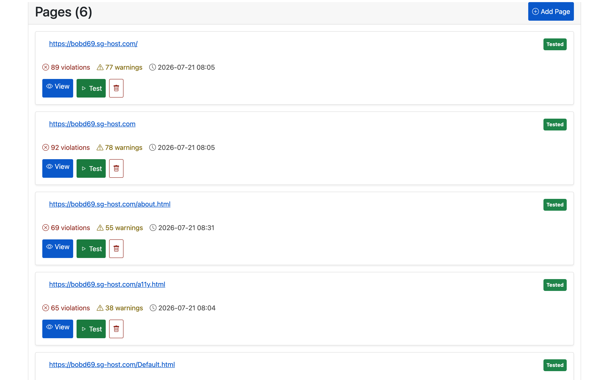

## 9. Cloaking: getting past bot protection

Many production sites sit behind bot-protection services such as Cloudflare.
These services try to distinguish real browsers from automated ones and will
challenge or block traffic they think is a bot — which an accessibility
crawler technically is. When a site is protected this way, discovery and
testing can fail with challenge pages instead of the real content.

**Stealth Mode** (the "cloaking" option) is Auto A11y's answer. When enabled,
the browser is disguised to look like an ordinary human-driven session — it
hides the automation flags that bot-detectors look for (the `webdriver`
marker, missing browser plugins, and similar tells) so the real page loads.

You enable it per project with the **Enable Stealth Mode (for
Cloudflare-protected sites)** checkbox in the project form.

> **Only use stealth mode when you need it.** The disguise adds significant
> overhead — roughly **5-15 seconds per page** — so discovery and testing run
> much more slowly. Leave it off for sites that don't challenge the crawler,
> and turn it on only when you see bot-protection pages instead of your
> content. You should also have authorization to test the site; evading bot
> protection on a site you don't control may violate its terms of service.

## 10. Test users: content behind logins

Much of a real application lives behind a login — a dashboard, an account
page, a checkout. An unauthenticated crawler never sees it, so those pages go
untested. Worse, what a user can see often depends on their **role**: a
student and an instructor see different pages in a learning platform, an
admin sees controls a regular user doesn't. Each of those views can have its
own accessibility problems.

**Test users** solve both. A test user is a stored login credential that the
test runner uses to sign in *before* testing, so authenticated pages are
audited as that user would see them. Because a user carries **roles**, you
can create one test user per role and test each role's version of the site.

Manage them from **Test Users** on the project page (they're shared across
all the project's websites).

When you create a test user you provide its credentials and choose an
**authentication method**:

- **Form login** — the standard username/password form; you tell Auto A11y
  the login URL and which fields to fill.
- **HTTP Basic Auth** — the browser's built-in credential prompt.
- **Manual login** — for logins Auto A11y can't automate (two-factor codes,
  multi-step SSO), you sign in yourself once in a visible browser and the
  session is captured and reused.

Each test user has a **Test Login** button that runs the login automation on
its own, so you can confirm the credentials and selectors work before
launching a full test run. In the results, every issue is labelled with the
user context it was found under (you'll see "Guest" for unauthenticated
tests), so role-specific problems are attributable to the role.

## 11. Setup scripts and multi-state testing

Sometimes the page you want to test isn't the page that first loads. A cookie
banner covers the content until dismissed. A modal has to be opened. A tab
has to be selected. A **setup script** is a short recorded sequence of
actions that prepares the page before testing.

Scripts live on individual pages (and can also be defined website-wide).
Open a page and choose **Scripts**, or use **Setup Scripts** on the website.

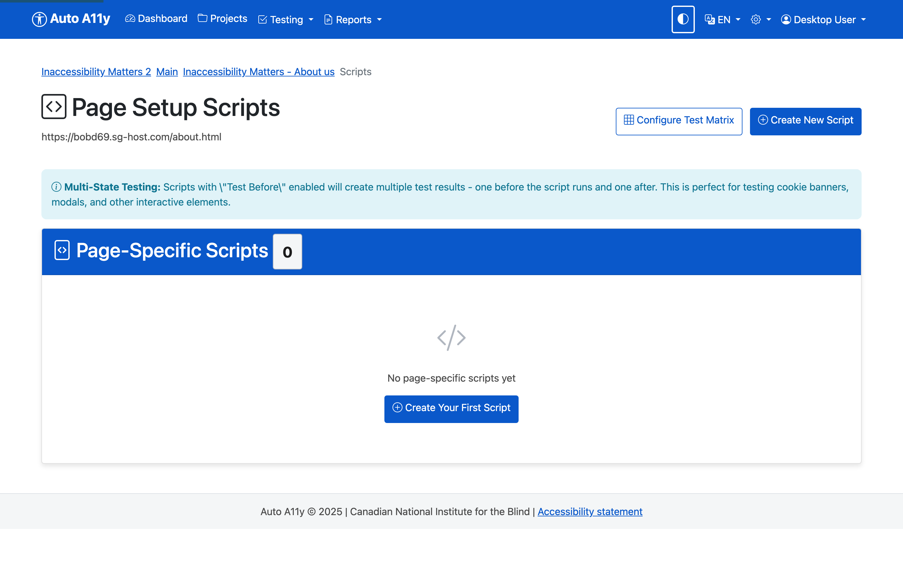

A script is a list of **steps**, each one an action:

| Step type | What it does |
| --- | --- |
| **Click** | Click a button or link (e.g. the cookie "Accept" button) |
| **Type** | Enter text into a field |
| **Wait for element** | Pause until a selector appears |
| **Wait (fixed)** | Pause for a set number of milliseconds |
| **Wait for navigation / network idle** | Pause until the page settles |
| **Scroll**, **Hover**, **Select**, **Screenshot** | Other page interactions |

Elements are targeted with CSS selectors (a class like `.cookie-banner`, an
id like `#accept-btn`, or an attribute selector). The script editor includes
a Quick Help panel with common selector patterns and worked examples.

### Multi-state testing: test before *and* after

Here's the powerful part. A script has a **Test Before** option. With it
enabled, a single test run produces **two** sets of results:

1. The page **before** the script runs — for a cookie banner, this is the
   page *with* the banner covering the content, so you catch any
   accessibility problems in the banner itself.
2. The page **after** the script runs — the banner dismissed, so you test the
   real underlying content that was hidden behind it.

**Worked example — a cookie notice:**

1. Create a script named "Dismiss Cookie Notice".
2. Add a step: **Wait for element** `.cookie-banner`.
3. Add a step: **Click** `.cookie-banner .accept-button`.
4. Enable **Test Before**.
5. Run the test.

You now get one result for the banner-covered state and one for the
banner-dismissed state, each with its own issue list, linked together and
labelled with the state they represent ("Initial page state" and "After
executing script: Dismiss Cookie Notice"). The same pattern works for testing
a modal open versus closed, or any two states of the same page.

## 12. Running tests

You can start a test at any scope:

| Where | Button | What runs |
| --- | --- | --- |
| Project page | **Test All Websites** | Every page in every website |
| Website page | **Test All Documents** | Every page (and PDF) in the site |
| Website page | **Test Untested Documents** | Only pages without results |
| Page list / page view | **Test** | That single page |

During a test, Auto A11y loads the page in a browser (signing in as a test
user and running any setup scripts first), injects and runs the JavaScript
check suite at each relevant breakpoint, captures a screenshot, and (when
enabled) sends the screenshot to Claude AI for visual analysis. Results are
saved to the page's history.

Tests run as background jobs; you can keep working while they run. Progress
is visible on the page itself and under *Testing → Dashboard*.

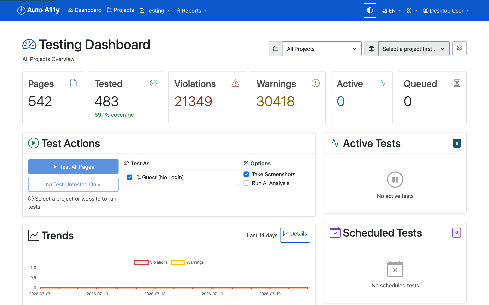

## 13. Reading test results

Open any tested page to see its **Latest Test Results** — the heart of the
product. Issues are grouped into severity sections (Errors, Warnings, Info,
Discovery), then by touchpoint, then by issue type.

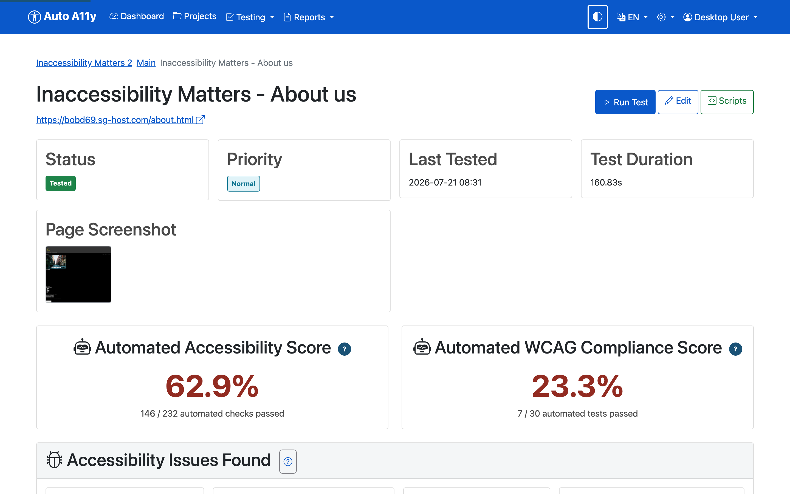

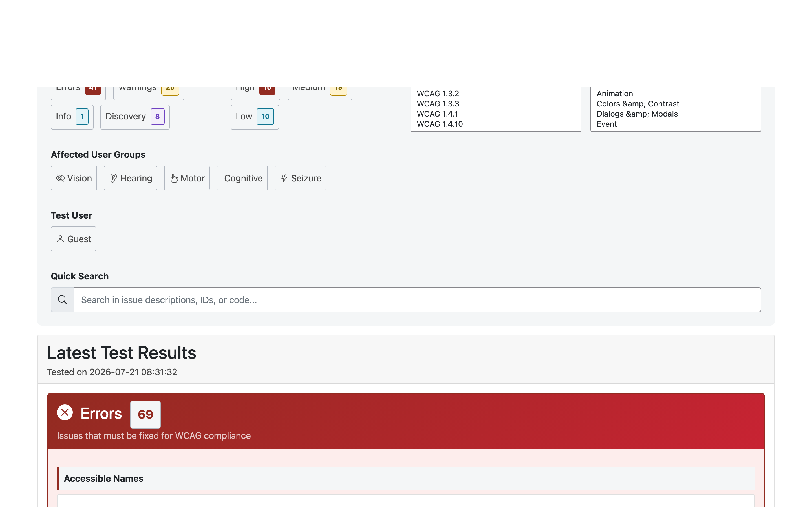

Each issue row shows its **impact** (High/Medium/Low), the **user context**
it was tested under (e.g. Guest, or a named test-user role), a plain-language
description, and the **XPath** locating the element. Issues with multiple
occurrences group their instances. Expand a row for the full detail:

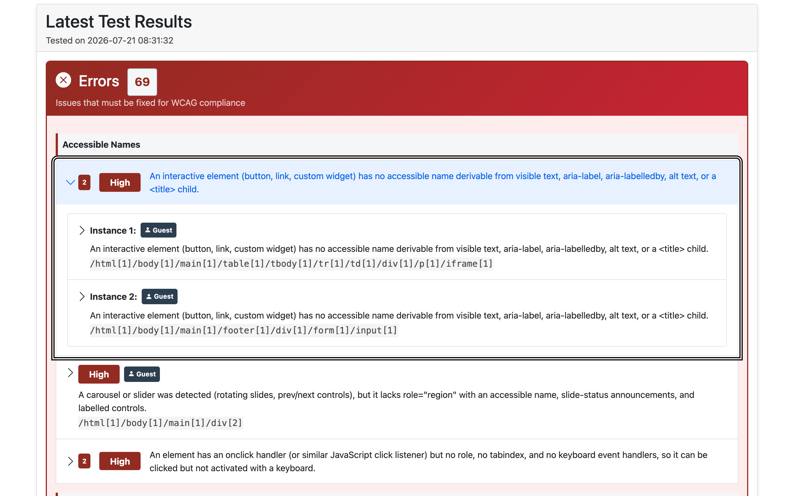

Inside an expanded issue you'll find:

- **What the issue is / Why it matters / Who it affects** — plain-language
  explanations suitable for sharing with content owners.
- **How to remediate** — concrete fix guidance.
- **WCAG success criteria** — with links to the W3C *Understanding* and
  *How to Meet* pages.
- **Location** — the XPath, with a copy button.
- **Code snippet** — the offending HTML.
- **Page thumbnail** — the page as it looked at test time.

Every page keeps a **Test History** table below the latest results, so you
can compare runs over time as fixes land. Pages tested in multiple states or
at multiple breakpoints show that context on each issue.

## 14. Testing PDFs

Accessibility obligations extend to the documents a site links to. Auto A11y
audits **PDF** files against PDF/UA (the PDF accessibility standard) and WCAG
— checking the tag structure, reading order, document metadata, and more.

PDFs are managed per project (and per website). Open **PDFs** from the
project or website page.

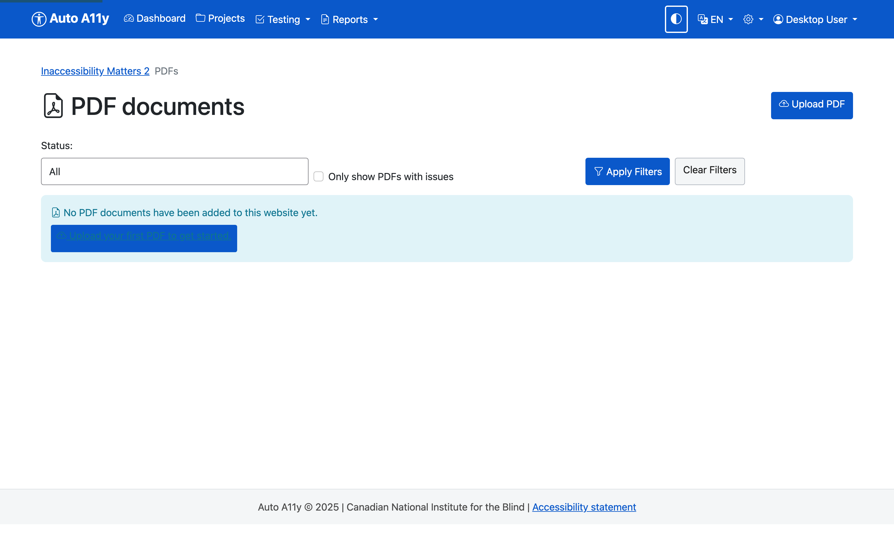

Add a PDF two ways:

- **Upload PDF** — upload a file from your computer.
- **Fetch by URL** — point Auto A11y at a PDF's web address and it retrieves
  it. (Website discovery can also find linked PDFs automatically.)

Once added, start an **audit** on the document. Like page tests, audits run
in the background; when complete, the PDF shows its issues (FAIL/WARN counts
against the accessibility checks), page images, and an issue map. You can
export a self-contained PDF audit report in Markdown or HTML, and filter the
PDF list to show only documents with issues.

## 15. Reports

Open **Reports** in the navigation. Six report types cover different
audiences and purposes; all generate in the background and appear under
*Recent Reports* when complete.

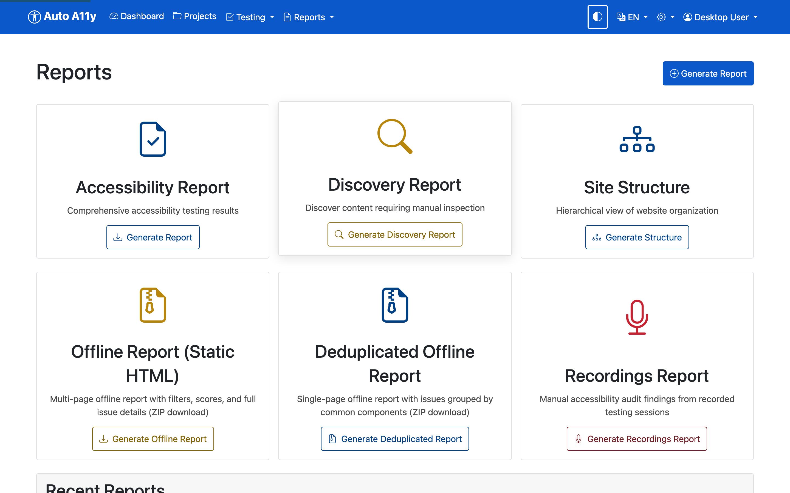

### Accessibility Report

*Audience: managers and stakeholders. The executive overview.*

A structured summary of a project's (or website's) accessibility state:
compliance score with letter grade, key metrics, issues by touchpoint and by
impact, the most frequent issues, prioritized recommendations, and an
**AI Executive Analysis** — an assessment written by Claude AI covering
strengths, critical risks, maturity level, user impact by disability group,
legal risk, and a phased remediation strategy.

Available formats: **HTML** (shown below), **Excel**, **CSV**, **JSON**, and
**PDF**.

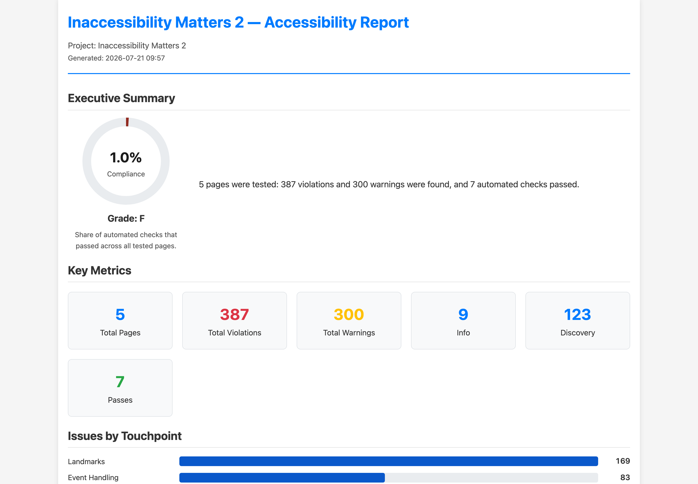

The **Excel** format is the working spreadsheet: an executive summary sheet
plus per-website sheets and a complete issue list with descriptions, WCAG
criteria, XPaths, and remediation guidance — ideal for tracking fixes.

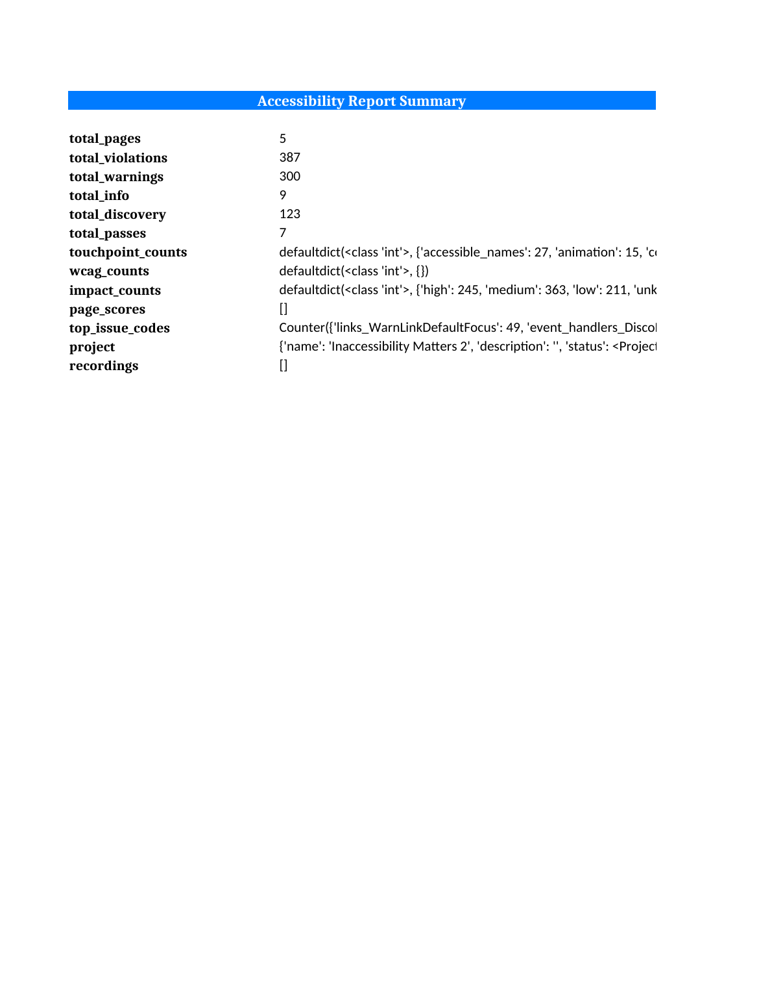

### Discovery Report

*Audience: auditors planning manual review.*

Lists the content that automated testing **cannot** judge — forms, videos,
PDFs, unusual typography, elements with questionable accessible names — so a
human reviewer knows exactly where to look. Site-wide issues (appearing on
most pages) are separated from page-specific ones so global components get
fixed once. Formats: HTML or PDF.

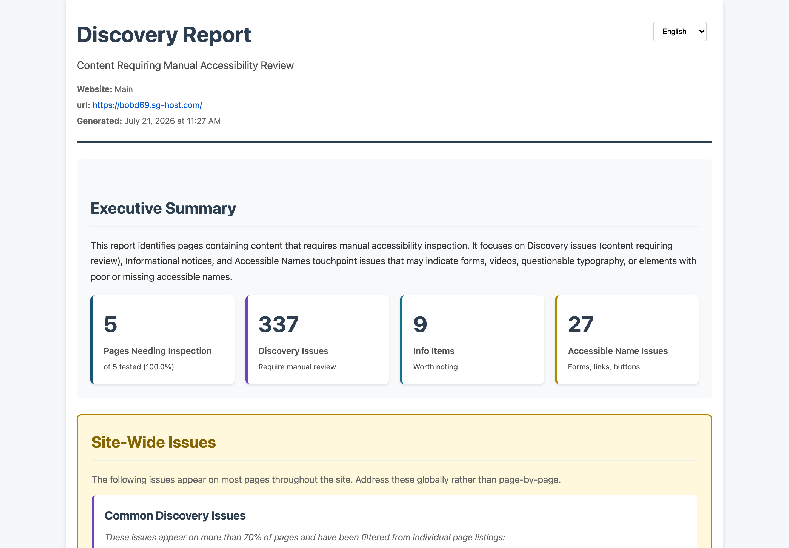

### Site Structure

*Audience: anyone needing to understand the site's shape.*

A hierarchical tree of the website's organization as discovered by the
crawler, with per-page violation counts — useful for scoping an audit and
spotting orphaned sections.

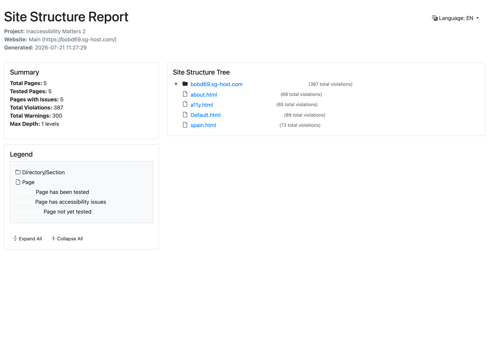

### Offline Report (Static HTML)

*Audience: clients and teams without access to the app.*

A complete, self-contained **multi-page website** delivered as a ZIP: an
index of all tested pages with scores and client-side search/filtering, a
summary page with statistics, and a full detail page per tested page with
the same issue accordions as the app. Everything — CSS, JavaScript, images,
screenshots — is bundled, so it works from a file share or email attachment
with no server and no internet. Bilingual: every page has an EN/FR switcher.

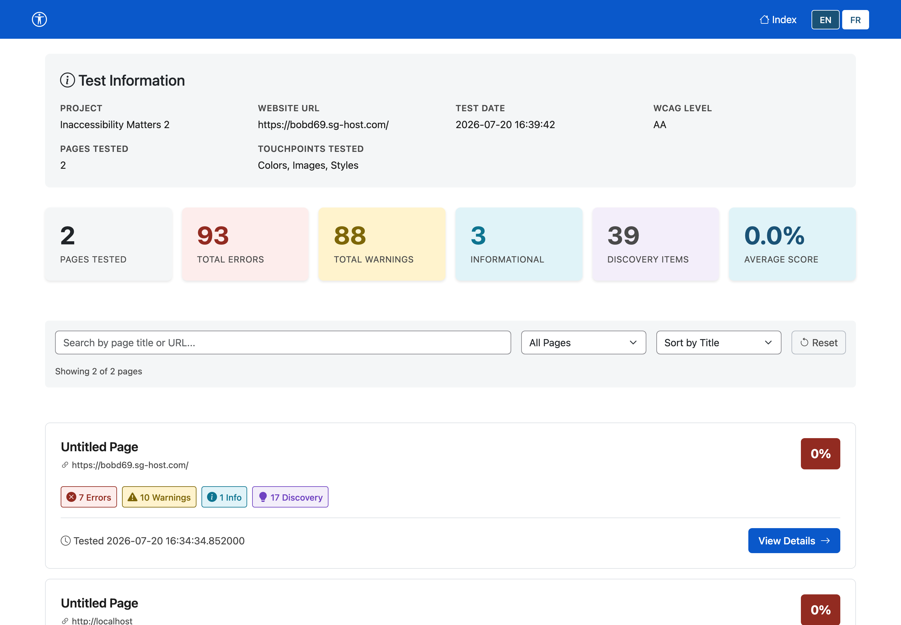

Options when generating: choose project or single website scope, WCAG level,
and whether to include screenshots and discovery items.

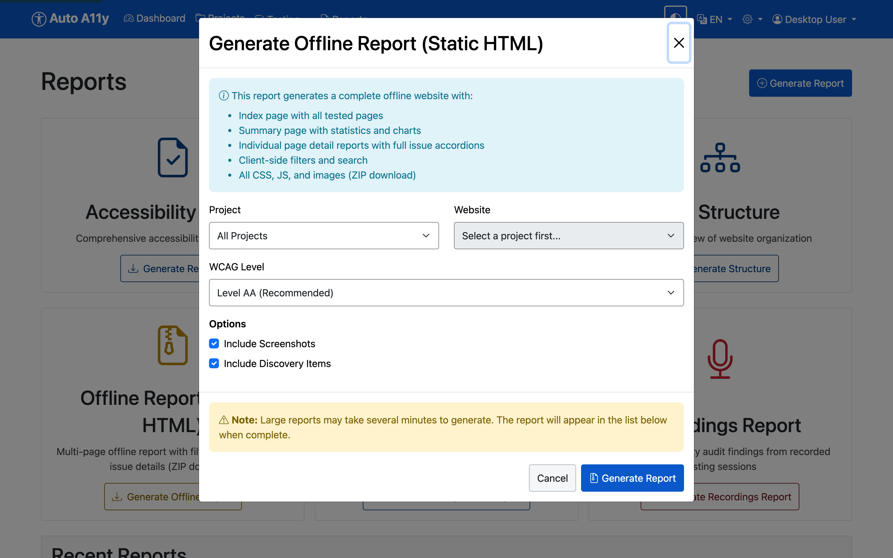

### Deduplicated Offline Report

*Audience: developers fixing a template-based site.*

The same offline ZIP concept, but issues are **grouped by common component**
— the header, navigation, and footer that repeat on every page are reported
once, with the pages they affect, instead of once per page. Scores are shown
both for the full page and excluding component issues, so you can see how
much a single template fix will move the needle. Also bilingual.

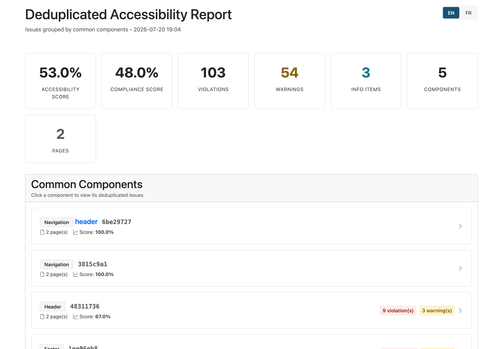

### Recordings Report

*Audience: teams complementing automation with lived experience.*

Compiles findings from **recorded manual testing sessions** — audio-recorded
walkthroughs by testers with disabilities, uploaded to the project — into an
audit document: user quotes with timecodes, pain points, and key takeaways,
alongside the structured issues raised. (This example uses the YVR Map
project, which has recorded sessions.)

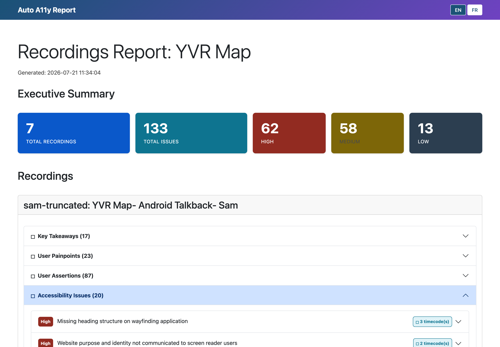

### Generating and downloading

Every report generates as a background job — large reports can take several
minutes. Finished reports appear in **Recent Reports** at the bottom of the
Reports page with a download button; failed jobs can be restarted, and
running jobs can be dropped.

## 16. Scheduling recurring tests

*Reports → Schedules* (or the Schedules button on a website page) lets you
run tests automatically — daily, weekly, or monthly — so trend data
accumulates without anyone remembering to click Test.

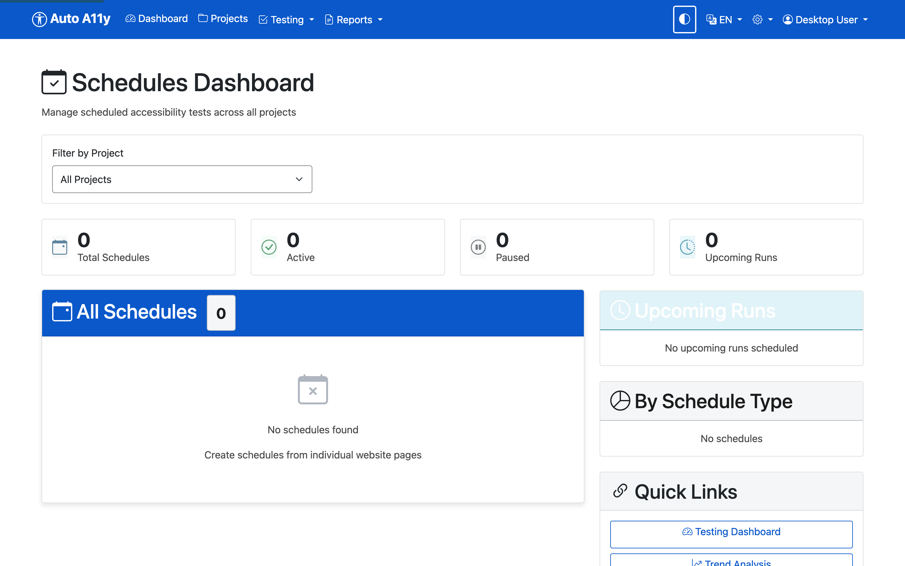

## 17. The Testing menu

- **Dashboard** — live and recent test activity across all projects.
- **Configure** — runtime testing options.
- **Fixture Status** — the quality gate: every check in the test suite with
  its validation state. Only checks passing all fixtures run in production.

  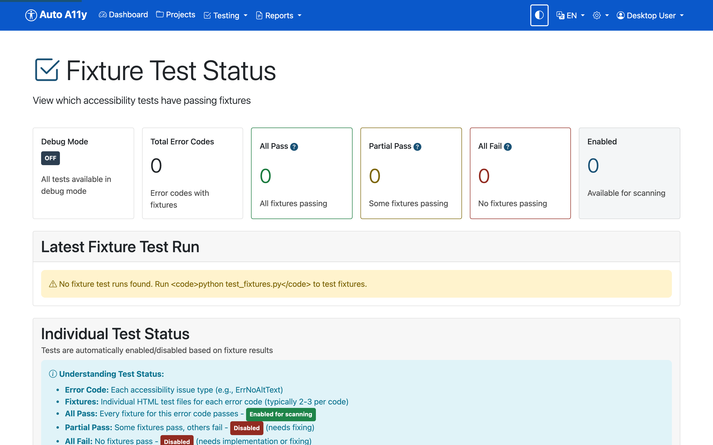

- **Trends** — violation and warning counts over time, so you can show
  progress between audits.

  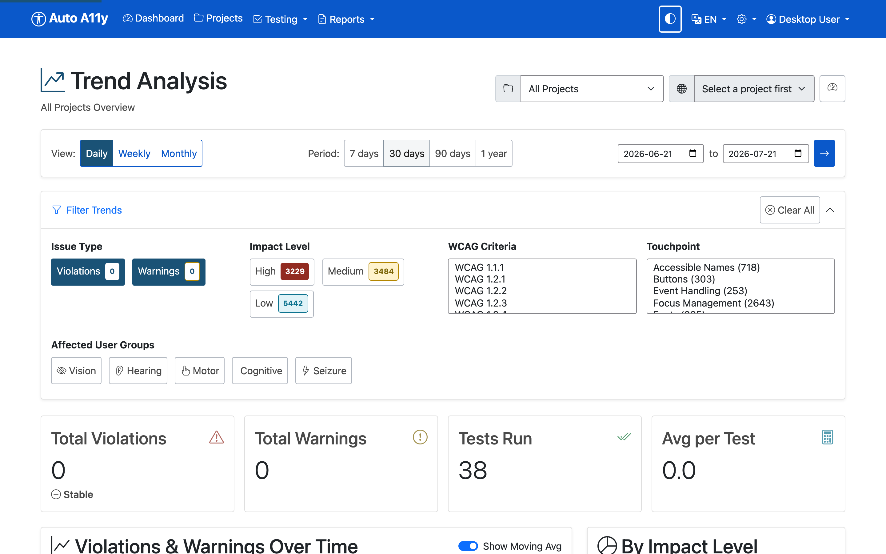

## 18. Tips, accessibility features, and troubleshooting

**The app practices what it audits.** The interface meets WCAG 2.2 AA: full
keyboard operation (expanded accordions draw a double-line focus ring around
the entire issue), dark mode via the toggle in the navigation bar, a full
French translation via the EN/FR switcher, and screen-reader-tested
components.

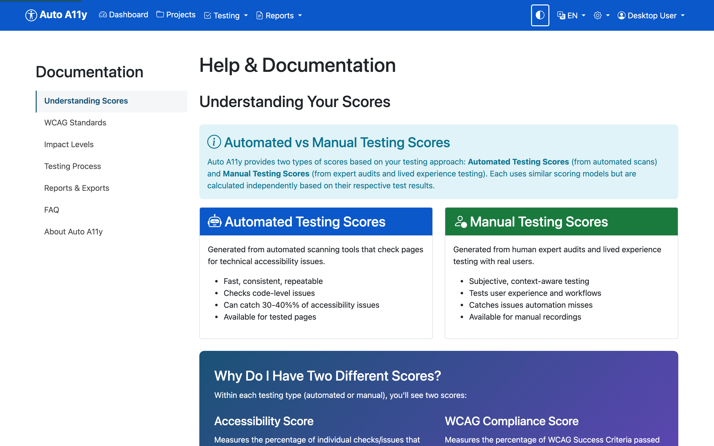

**A page loads in the browser but the test reports "Failed to load page".**
Usually the page never finishes loading its network activity (hung
third-party images, long-polling scripts). Auto A11y tolerates this — it
tests the loaded DOM after a grace period — but a page that cannot even
reach *domcontentloaded* within 30 seconds will fail. Check the URL is
reachable from this machine.

**Discovery or testing returns bot-challenge pages instead of content.** The
site is bot-protected; enable **Stealth Mode** on the project (see
[section 9](#9-cloaking-getting-past-bot-protection)).

**Authenticated pages aren't being tested.** Add a **test user** with valid
credentials and confirm it with the **Test Login** button (see
[section 10](#10-test-users-content-behind-logins)).

**A check you expected didn't run.** Two possibilities: it's disabled in the
project's touchpoint configuration (see
[section 5](#5-choosing-which-tests-to-run)), or it hasn't passed fixture
validation — check *Testing → Fixture Status*.

**AI analysis findings are missing.** AI visual analysis is off by default;
enable it per project and confirm *AI Analysis: Enabled* on the Dashboard.
Remember it incurs API costs and its results can vary between runs (see
[section 6](#6-automated-checks-versus-ai-analysis)).

**Report generation seems stuck.** Reports over large sites take minutes.
The Reports page shows job progress; a stalled job can be dropped and
restarted from *Recent Reports*.

**The numbers in this guide look alarming.** They should — *Inaccessibility
Matters* is a demonstration site built to fail. A 1.0% compliance score is
the point.

## 19. Appendix A: Tests by touchpoint

This appendix lists every check in the automated test suite, grouped by
touchpoint. Whether a given check runs on a project depends on its
fixture-validation status and the project's touchpoint configuration (see
[section 5](#5-choosing-which-tests-to-run)). The AI-assisted analyses
(section 6) are separate from this catalog.

<!-- BEGIN GENERATED TEST APPENDIX -->

The automated test suite contains **213 checks** across **19 touchpoints**. Whether each check runs depends on its fixture-validation status and the project's touchpoint configuration. Types: **Error** (WCAG violation), **Warning** (likely barrier), **Info** (informational), **Discovery** (needs manual review).

### ARIA

| Check | Type | What it tests |
| ---------------------------------- | ---------------- | ------------------------------------------------------------ |
| `ErrAriaLabelMayNotBeFoundByVoiceControl` | Error | aria-label doesn't match visible text |
| `ErrLabelMismatchOfAccessibleNameAndLabelText` | Error | Accessible name doesn't match visible label |

### Buttons

| Check | Type | What it tests |
| ---------------------------------- | ---------------- | ------------------------------------------------------------ |
| `ErrButtonClipPathWithOutline` | Error | Button with non-rectangular clip-path uses outline for focus indicator - outline draws rectangular box not following clipped shape |
| `ErrButtonFocusContrastFail` | Error | Button focus outline has insufficient contrast (less than 3:1) against the button's current background color |
| `ErrButtonFocusObscured` | Error | Button focus indicator is partially or fully obscured by other elements due to z-index stacking |
| `ErrButtonOutlineOffsetInsufficient` | Error | Button focus outline has outline-offset less than 2px, causing the outline to be lost within the button element |
| `ErrButtonOutlineWidthInsufficient` | Error | Button focus outline has outline-width less than 2px, making it too thin to be clearly visible |
| `ErrButtonSingleSideBoxShadow` | Error | Button uses outline:none with box-shadow that only appears on one side (directional shadow with offset) |
| `ErrButtonTransparentOutline` | Error | Button focus outline uses semi-transparent color (alpha < 0.5) which cannot guarantee sufficient visibility |
| `WarnButtonDefaultFocus` | Warning | Button uses browser default focus outline which may not meet contrast requirements on all backgrounds |
| `WarnButtonFocusGradientBackground` | Warning | Button with gradient background has focus outline - contrast cannot be automatically verified against gradient |
| `WarnButtonFocusImageBackground` | Warning | Button with background image has focus outline - contrast cannot be automatically verified against image |
| `WarnButtonGenericText` | Warning | Button uses generic text like "Click here", "Submit", or "OK" without context |
| `WarnButtonOutlineNoneWithBoxShadow` | Warning | Button uses outline:none with box-shadow for focus, which may not provide clear indication on all sides |

### Colours & Contrast

| Check | Type | What it tests |
| ---------------------------------- | ---------------- | ------------------------------------------------------------ |
| `ErrColorRelatedStyleDefinedExplicitlyInElement` | Warning | Color-related styles defined inline |
| `ErrColorRelatedStyleDefinedExplicitlyInStyleTag` | Warning | Color-related styles defined in style tag |
| `ErrTextContrast` | Error | Text color has insufficient contrast ratio with its background color |

### Electronic Documents

| Check | Type | What it tests |
| ---------------------------------- | ---------------- | ------------------------------------------------------------ |
| `DiscoPDFLinksFound` | Discovery | Links to PDF documents detected on page |

### Event Handling

| Check | Type | What it tests |
| ---------------------------------- | ---------------- | ------------------------------------------------------------ |
| `DiscoFoundJS` | Discovery | JavaScript detected on page |
| `ErrHandlerColorChangeOnly` | Error | Element with event handler indicates focus only through color change without structural change |
| `ErrHandlerFocusContrastFail` | Error | Focus indicator on element with event handler has less than 3:1 contrast ratio with adjacent colors |
| `ErrHandlerNoVisibleFocus` | Error | Non-interactive element with event handler (onclick, etc.) lacks a visible focus indicator |
| `ErrHandlerOutlineNoneNoBoxShadow` | Error | Element with event handler removes default outline with 'outline:none' but provides no alternative focus indicator |
| `ErrHandlerOutlineWidthInsufficient` | Error | Element with event handler has a focus outline less than 2 CSS pixels thick |
| `ErrHandlerSingleSideBoxShadow` | Error | Element with event handler uses box-shadow on only one side for focus indicator |
| `ErrHandlerTransparentOutline` | Error | Element with event handler uses semi-transparent (alpha < 0.5) focus outline or box-shadow |
| `ErrTabindexAriaHiddenFocusable` | Error | Element has both tabindex (making it focusable) and aria-hidden='true', which is invalid HTML and creates conflicting accessibility semantics |
| `ErrTabindexChildOfInteractive` | Error | Child element has tabindex attribute inside an interactive parent element (button, link, etc.), creating improper structure where assistive technologies cannot properly understand the relationships |
| `ErrTabindexColorChangeOnly` | Error | Element with tabindex indicates focus only through color change without structural change (outline, border, shape) |
| `ErrTabindexFocusContrastFail` | Error | Focus indicator on element with tabindex has less than 3:1 contrast ratio with adjacent colors |
| `ErrTabindexNoVisibleFocus` | Error | Non-interactive element made focusable with tabindex attribute lacks a visible focus indicator |
| `ErrTabindexOutlineNoneNoBoxShadow` | Error | Element with tabindex removes default outline with 'outline:none' but provides no alternative focus indicator |
| `ErrTabindexOutlineWidthInsufficient` | Error | Element with tabindex has a focus outline less than 2 CSS pixels thick |
| `ErrTabindexSingleSideBoxShadow` | Error | Element with tabindex uses box-shadow on only one side (top, right, bottom, or left) for focus indicator |
| `ErrTabindexTransparentOutline` | Error | Element with tabindex uses semi-transparent (alpha < 0.5) focus outline or box-shadow |
| `WarnHandlerDefaultFocus` | Warning | Element with event handler has no custom focus styles and relies on browser default focus indicator |
| `WarnHandlerNoBorderOutline` | Warning | Element with event handler uses only CSS outline for focus with no border or size change |
| `WarnTabindexDefaultFocus` | Warning | Element with tabindex has no custom focus styles and relies on browser default focus indicator |
| `WarnTabindexNoBorderOutline` | Warning | Element with tabindex uses only CSS outline for focus with no border or size change |

### Focus Management

| Check | Type | What it tests |
| ---------------------------------- | ---------------- | ------------------------------------------------------------ |
| `ErrNegativeTabIndex` | Error | Negative tabindex on interactive element |
| `ErrNoOutlineOffsetDefined` | Error | No outline offset defined for focus |
| `ErrOutlineIsNoneOnInteractiveElement` | Error | Interactive element has CSS outline:none removing the default focus indicator |
| `ErrPositiveTabIndex` | Error | Element uses a positive tabindex value (greater than 0) |
| `ErrTTabindexOnNonInteractiveElement` | Error | Tabindex attribute on non-interactive element |
| `ErrTabindexOfZeroOnNonInteractiveElement` | Error | tabindex="0" on non-interactive element |
| `ErrWrongTabindexForInteractiveElement` | Error | Inappropriate tabindex on interactive element |
| `ErrZeroOutlineOffset` | Error | Outline offset is set to zero |

### Fonts & Typography

| Check | Type | What it tests |
| ---------------------------------- | ---------------- | ------------------------------------------------------------ |
| `DiscoFontFound` | Discovery | Font usage detected for review |
| `WarnFontNotInRecommenedListForA11y` | Warning | Font not in recommended accessibility list |

### Forms

| Check | Type | What it tests |
| ---------------------------------- | ---------------- | ------------------------------------------------------------ |
| `DiscoFormOnPage` | Discovery | Form detected on page - needs manual testing |
| `ErrEmptyAriaLabelOnField` | Error | Form field has empty aria-label attribute |
| `ErrEmptyAriaLabelledByOnField` | Error | Form field has empty aria-labelledby attribute |
| `ErrFielLabelledBySomethingNotALabel` | Error | Field is labeled by an element that is not a proper label |
| `ErrFieldAriaRefDoesNotExist` | Error | aria-labelledby references non-existent element |
| `ErrFieldLabelledUsingAriaLabel` | Error | Field labeled using aria-label instead of visible label |
| `ErrFieldReferenceDoesNotExist` | Error | Label for attribute references non-existent field |
| `ErrFormEmptyHasNoChildNodes` | Error | Form element is completely empty with no child nodes |
| `ErrFormEmptyHasNoInteractiveElements` | Error | Form has content but no interactive elements |
| `ErrInputBorderChangeInsufficient` | Error | Input field border thickens on focus but change is less than 1px (not manifest) |
| `ErrInputFocusColorChangeOnly` | Error | Input field focus indicator relies solely on border color change without structural change |
| `ErrInputFocusContrastFail` | Error | Input field focus indicator has insufficient color contrast (< 3:1) against background |
| `ErrInputNoVisibleFocus` | Error | Text input field has no visible focus indicator (outline:none, no border change, no box-shadow) |
| `ErrInputOutlineWidthInsufficient` | Error | Input field focus outline is less than 2px wide |
| `ErrInputSingleSideBoxShadow` | Error | Input field uses single-sided box-shadow for focus indicator (does not follow field shape) |
| `ErrLabelContainsMultipleFields` | Error | Single label contains multiple form fields |
| `ErrOrphanLabelWithNoId` | Error | Label element exists but has no for attribute |
| `WarnFieldLabelledByMulitpleElements` | Warning | Field is labeled by multiple elements via aria-labelledby |
| `WarnInputDefaultFocus` | Warning | Input field relies on default browser focus styles which vary across browsers and platforms |
| `WarnInputFocusGradientBackground` | Warning | Input field has gradient background - focus indicator contrast cannot be automatically verified |
| `WarnInputFocusOutlineExceedsParent` | Warning | Input focus outline extends beyond parent container bounds - outline contrast cannot be automatically verified |
| `WarnInputFocusParentGradientBackground` | Warning | Input parent container has gradient background - focus outline contrast cannot be automatically verified |
| `WarnInputFocusParentImageBackground` | Warning | Input parent container has background image - focus outline contrast cannot be automatically verified |
| `WarnInputFocusParentZIndexFloating` | Warning | Input parent container has z-index without solid background - focus outline contrast cannot be automatically verified |
| `WarnInputFocusZIndexFloating` | Warning | Input field has z-index positioning and may float over varying backgrounds - focus outline contrast cannot be automatically verified |
| `WarnInputNoBorderOutline` | Warning | Input field uses border/box-shadow changes but no separate outline for focus indicator |
| `WarnInputTransparentFocus` | Warning | Input field focus indicator is semi-transparent (alpha < 0.5) which may not provide sufficient visibility |
| `forms_DiscoNoSubmitButton` | Discovery | Form may lack clear submit button |
| `forms_WarnGenericButtonText` | Warning | Button has generic text like "Submit" or "Click here" |
| `forms_WarnNoFieldset` | Warning | Radio/checkbox group lacks fieldset and legend |
| `forms_WarnRequiredNotIndicated` | Warning | Required field not clearly indicated |

### Headings

| Check | Type | What it tests |
| ---------------------------------- | ---------------- | ------------------------------------------------------------ |
| `ErrEmptyHeading` | Error | Heading element (h1-h6) contains no text content or only whitespace |
| `ErrFoundAriaLevelButNoRoleAppliedAtAll` | Error | aria-level attribute without role="heading" |
| `ErrFoundAriaLevelButRoleIsNotHeading` | Error | aria-level on element without heading role |
| `ErrHeadingAccessibleNameMismatch` | Error | Visible heading text doesn't match its accessible name |
| `ErrHeadingLevelsSkipped` | Error | Heading levels are not in sequential order - one or more levels are skipped (e.g., h1 followed by h3 with no h2) |
| `ErrHeadingOrder` | Error | Headings appear in illogical order - high-level headings (H1, H2) appear after lower-level headings (H3, H4, H5, H6) |
| `ErrHeadingsDontStartWithH1` | Error | First heading on page is not h1 |
| `ErrInvalidAriaLevel` | Error | Invalid aria-level value (not 1-6) |
| `ErrMultipleH1HeadingsOnPage` | Error | Multiple h1 elements found on page |
| `ErrNoH1OnPage` | Error | Page is missing an h1 element to identify the main topic |
| `ErrNoHeadingsOnPage` | Error | No heading elements (h1-h6) found anywhere on the page |
| `ErrRoleOfHeadingButNoLevelGiven` | Error | role="heading" without aria-level |
| `WarnHeadingInsideDisplayNone` | Warning | Heading is hidden with display:none |
| `WarnHeadingOver60CharsLong` | Warning | Heading text exceeds 60 characters |

### Images

| Check | Type | What it tests |
| ---------------------------------- | ---------------- | ------------------------------------------------------------ |
| `DiscoFoundInlineSvg` | Discovery | Inline SVG element detected that requires manual review to determine appropriate accessibility implementation based on its purpose and complexity |
| `DiscoFoundSvgImage` | Discovery | SVG element with role="img" detected that requires manual review to verify appropriate text alternatives are provided |
| `ErrAltOnElementThatDoesntTakeIt` | Error | Alt attribute placed on HTML elements that don't support it (such as div, span, p, or other non-image elements), making the alternative text inaccessible to assistive technologies |
| `ErrImageAltContainsHTML` | Error | Image's alternative text contains HTML markup tags |
| `ErrImageWithEmptyAlt` | Error | Image alt attribute contains only whitespace characters (spaces, tabs, line breaks), providing no accessible name |
| `ErrImageWithImgFileExtensionAlt` | Error | Alt text contains image filename with file extension (e.g., "photo.jpg", "IMG_1234.png", "banner.gif"), providing no meaningful description of the image content |
| `ErrImageWithURLAsAlt` | Error | Alt attribute contains a URL (starting with `http://` `https://` `www` or `file://` instead of descriptive text about the image content |

### Landmarks

| Check | Type | What it tests |
| ---------------------------------- | ---------------- | ------------------------------------------------------------ |
| `ErrBannerLandmarkAccessibleNameIsBlank` | Error | Banner landmark has blank accessible name |
| `ErrBannerLandmarkHasAriaLabelAndAriaLabelledByAttrs` | Error | Banner landmark has both aria-label and aria-labelledby |
| `ErrBannerLandmarkMayNotBeChildOfAnotherLandmark` | Error | Banner landmark nested inside another landmark |
| `ErrComplementaryLandmarkAccessibleNameIsBlank` | Error | Complementary landmark has blank accessible name |
| `ErrComplementaryLandmarkHasAriaLabelAndAriaLabelledByAttrs` | Error | Complementary landmark has both aria-label and aria-labelledby |
| `ErrComplementaryLandmarkMayNotBeChildOfAnotherLandmark` | Error | Complementary landmark is nested inside another landmark |
| `ErrCompletelyEmptyNavLandmark` | Error | Navigation landmark contains no content |
| `ErrContentInfoLandmarkAccessibleNameIsBlank` | Error | Contentinfo landmark has blank accessible name |
| `ErrContentInfoLandmarkHasAriaLabelAndAriaLabelledByAttrs` | Error | Contentinfo landmark has both aria-label and aria-labelledby |
| `ErrContentOutsideLandmarks` | Error | Content exists outside of landmark regions, making it invisible to screen reader landmark navigation |
| `ErrContentinfoLandmarkMayNotBeChildOfAnotherLandmark` | Error | Contentinfo landmark is nested inside another landmark |
| `ErrDuplicateLabelForBannerLandmark` | Error | Multiple banner landmarks have the same label |
| `ErrDuplicateLabelForComplementaryLandmark` | Error | Multiple complementary landmarks have the same label |
| `ErrDuplicateLabelForContentinfoLandmark` | Error | Multiple contentinfo landmarks have the same label |
| `ErrDuplicateLabelForFormLandmark` | Error | Multiple form landmarks have the same label |
| `ErrDuplicateLabelForNavLandmark` | Error | Multiple navigation landmarks have the same label |
| `ErrDuplicateLabelForRegionLandmark` | Error | Multiple region landmarks have the same label |
| `ErrDuplicateLabelForSearchLandmark` | Error | Multiple search landmarks have the same label |
| `ErrElementNotContainedInALandmark` | Error | Content exists outside of any landmark |
| `ErrFormAriaLabelledByIsBlank` | Error | Form aria-labelledby references blank or empty element |
| `ErrFormAriaLabelledByReferenceDIsHidden` | Error | Form aria-labelledby references hidden element |
| `ErrFormAriaLabelledByReferenceDoesNotExist` | Error | Form aria-labelledby references non-existent element |
| `ErrFormAriaLabelledByReferenceDoesNotReferenceAHeading` | Error | Form aria-labelledby doesn't reference a heading element |
| `ErrFormLandmarkAccessibleNameIsBlank` | Error | Form landmark has blank accessible name |
| `ErrFormLandmarkHasAriaLabelAndAriaLabelledByAttrs` | Error | Form landmark has both aria-label and aria-labelledby |
| `ErrFormUsesAriaLabelInsteadOfVisibleElement` | Error | Form uses aria-label instead of visible heading or label |
| `ErrFormUsesTitleAttribute` | Error | Form uses title attribute for labeling |
| `ErrMainLandmarkHasAriaLabelAndAriaLabelledByAttrs` | Error | Main landmark has both aria-label and aria-labelledby attributes |
| `ErrMainLandmarkHasTabindexOfZeroCanOnlyHaveMinusOneAtMost` | Error | Main landmark has tabindex="0" which is inappropriate |
| `ErrMainLandmarkIsHidden` | Error | Main landmark is hidden from view |
| `ErrMainLandmarkMayNotbeChildOfAnotherLandmark` | Error | Main landmark nested inside another landmark |
| `ErrMultipleBannerLandmarksOnPage` | Error | Multiple banner landmarks found |
| `ErrMultipleContentinfoLandmarksOnPage` | Error | Multiple contentinfo landmarks found |
| `ErrMultipleMainLandmarksOnPage` | Error | Multiple main landmark regions found on the page |
| `ErrNavLandmarkAccessibleNameIsBlank` | Error | Navigation landmark has blank accessible name |
| `ErrNavLandmarkContainsOnlyWhiteSpace` | Error | Navigation landmark contains only whitespace |
| `ErrNavLandmarkHasAriaLabelAndAriaLabelledByAttrs` | Error | Navigation landmark has both aria-label and aria-labelledby |
| `ErrNestedNavLandmarks` | Error | Navigation landmarks are nested |
| `ErrNoBannerLandmarkOnPage` | Error | Page is missing a banner landmark to identify the site header region |
| `ErrNoMainLandmarkOnPage` | Error | Page is missing a main landmark region to identify the primary content area |
| `ErrRegionLandmarkHasAriaLabelAndAriaLabelledByAttrs` | Error | Region landmark has both aria-label and aria-labelledby |
| `RegionLandmarkAccessibleNameIsBlank` | Error | Region landmark has blank accessible name |
| `WarnBannerLandmarkAccessibleNameUsesBanner` | Warning | Banner landmark uses generic term "banner" in label |
| `WarnComplementaryLandmarkAccessibleNameUsesComplementary` | Warning | Complementary landmark label uses generic term "complementary" |
| `WarnComplementaryLandmarkHasNoLabel` | Warning | Complementary landmark lacks a label |
| `WarnContentInfoLandmarkHasNoLabel` | Warning | Contentinfo landmark lacks a label |
| `WarnContentinfoLandmarkAccessibleNameUsesContentinfo` | Warning | Contentinfo landmark uses generic term "contentinfo" in label |
| `WarnFormLandmarkAccessibleNameUsesForm` | Warning | Form landmark uses generic term "form" in label |
| `WarnHeadingFoundInLandmarkButIsLabelledByAnAriaLabelledBy` | Error | Landmark has heading but uses different element for label |
| `WarnHeadingFoundInsideLandmarkButDoesntLabelLandmark` | Warning | Heading inside landmark doesn't label the landmark |
| `WarnMultipleBannerLandmarksButNotAllHaveLabels` | Warning | Multiple banner landmarks exist but not all have labels |
| `WarnMultipleComplementaryLandmarksButNotAllHaveLabels` | Warning | Multiple complementary landmarks but not all labeled |
| `WarnMultipleContentInfoLandmarksButNotAllHaveLabels` | Warning | Multiple contentinfo landmarks exist but not all have labels |
| `WarnMultipleNavLandmarksButNotAllHaveLabels` | Warning | Multiple navigation landmarks but not all labeled |
| `WarnMultipleRegionLandmarksButNotAllHaveLabels` | Warning | Multiple region landmarks but not all labeled |
| `WarnNavLandmarkAccessibleNameUsesNavigation` | Warning | Navigation landmark uses generic term "navigation" in label |
| `WarnNavLandmarkHasNoLabel` | Warning | Navigation landmark lacks label |
| `WarnNoContentinfoLandmarkOnPage` | Warning | Page is missing a contentinfo landmark to identify the footer region |
| `WarnNoNavLandmarksOnPage` | Warning | Page has no navigation landmarks to identify navigation regions |
| `WarnRegionLandmarkAccessibleNameUsesNavigation` | Warning | Region landmark incorrectly uses "navigation" in its label |
| `WarnRegionLandmarkHasNoLabelSoIsNotConsideredALandmark` | Warning | Region landmark lacks required label to be considered a landmark |

### Language

| Check | Type | What it tests |
| ---------------------------------- | ---------------- | ------------------------------------------------------------ |
| `ErrElementPrimaryLangNotRecognized` | Error | Element has unrecognized language code |
| `ErrElementRegionQualifierNotRecognized` | Error | Element lang attribute has unrecognized region qualifier |
| `ErrEmptyLanguageAttribute` | Error | Element (non-HTML) has a lang attribute present but with no value (lang=""), preventing screen readers from determining language changes |
| `ErrEmptyXmlLangAttr` | Error | xml:lang attribute is empty |
| `ErrHreflangAttrEmpty` | Error | hreflang attribute is empty on link |
| `ErrHreflangNotOnLink` | Error | hreflang attribute on non-link element |
| `ErrIncorrectlyFormattedPrimaryLang` | Error | Language code incorrectly formatted |
| `ErrPrimaryHrefLangNotRecognized` | Error | hreflang language code not recognized |
| `ErrPrimaryLangAndXmlLangMismatch` | Error | lang and xml:lang attributes don't match |
| `ErrPrimaryLangUnrecognized` | Error | Language code not recognized |
| `ErrPrimaryXmlLangUnrecognized` | Error | xml:lang language code not recognized |
| `ErrRegionQualifierForHreflangUnrecognized` | Error | hreflang region qualifier not recognized |
| `ErrRegionQualifierForPrimaryLangNotRecognized` | Error | Region qualifier in primary language code not recognized (e.g., "en-XY") |
| `ErrRegionQualifierForPrimaryXmlLangNotRecognized` | Error | Region qualifier in xml:lang not recognized |

### Links

| Check | Type | What it tests |
| ---------------------------------- | ---------------- | ------------------------------------------------------------ |
| `ErrAnchorTargetTabindex` | Error | In-page link target (element with id referenced by href="#id") is not keyboard accessible - non-interactive element needs tabindex="-1" |
| `ErrDocumentLinkMissingFileType` | Error | Link to downloadable document (PDF, Word, Excel, PowerPoint, etc.) does not indicate the file type in its accessible name |
| `ErrDocumentLinkWrongLanguage` | Error | Link to a downloadable document in a different language than the page language lacks lang attribute or language indication |
| `ErrLinkButtonMissingSpaceHandler` | Error | Link is styled to look like a button but lacks Space key handler - keyboard users expect Space key to activate button-like elements |
| `ErrLinkColorChangeOnly` | Error | Link focus indicator relies solely on color change without outline, border, box-shadow, or underline |
| `ErrLinkFocusContrastFail` | Error | Link focus indicator (outline, border, or underline) has contrast ratio < 3:1 against the background |
| `ErrLinkImageNoFocusIndicator` | Error | Image link has no visible focus indicator (no outline, border, or box-shadow) |
| `ErrLinkOpensNewWindowNoWarning` | Error | Link opens in new window/tab without warning users |
| `ErrLinkOutlineWidthInsufficient` | Error | Link focus outline width is less than 2px |
| `ErrLinkTextNotDescriptive` | Error | Link text does not adequately describe the link's destination or purpose |
| `WarnColorOnlyLink` | Warning | Link in flowing text is distinguished from surrounding text only by color, without underline, border, or other non-color visual indicator |
| `WarnColorOnlyLinkWeakIndicator` | Warning | Link in flowing text uses only subtle visual indicators (font-weight, bold, or text-shadow) in addition to color - these can be difficult for users to recognize as links |
| `WarnLinkDefaultFocus` | Warning | Link uses browser default focus styles which vary across browsers and may fail contrast requirements |
| `WarnLinkFocusGradientBackground` | Warning | Link has gradient background - focus indicator contrast cannot be automatically verified and requires manual testing |
| `WarnLinkLooksLikeButton` | Warning | Link is styled to look like a button but uses anchor element |
| `WarnLinkOutlineOffsetTooLarge` | Warning | Link has both underline and outline with outline-offset > 1px, creating confusing visual gap |
| `WarnLinkTransparentOutline` | Warning | Link focus outline or border uses semi-transparent color (alpha < 0.5) which cannot guarantee sufficient contrast |
| `WarnMissingDocumentMetadata` | Warning | Link to downloadable document does not provide additional metadata such as file size or page count |

### Lists

| Check | Type | What it tests |
| ---------------------------------- | ---------------- | ------------------------------------------------------------ |
| `ErrListitemEmpty` | Error | List item (`<li>` or role="listitem") is empty or contains only whitespace, providing no content for users |

### Navigation

| Check | Type | What it tests |
| ---------------------------------- | ---------------- | ------------------------------------------------------------ |
| `ErrNoCurrentPageIndicatorMagnification` | Error | Navigation lacks visual current page indicator, preventing screen magnifier users from knowing their location without panning |
| `ErrNoCurrentPageIndicatorScreenReader` | Error | Navigation lacks aria-current="page" indicator, forcing screen reader users through entire menu to discover current location |

### Page

| Check | Type | What it tests |
| ---------------------------------- | ---------------- | ------------------------------------------------------------ |
| `ErrEmptyPageTitle` | Error | Page title element is empty |
| `ErrMissingDocumentType` | Error | HTML document is missing the DOCTYPE declaration (<!DOCTYPE html>) at the beginning of the file |
| `ErrMultiplePageTitles` | Error | Multiple title elements found in document head causing unpredictable behavior |
| `ErrNoPageTitle` | Error | Page has no `<title>` element in the document head |

### Page Title

| Check | Type | What it tests |
| ---------------------------------- | ---------------- | ------------------------------------------------------------ |
| `ErrEmptyTitleAttr` | Error | Empty title attribute |
| `ErrIframeWithNoTitleAttr` | Error | Iframe element is missing the required title attribute |
| `ErrImproperTitleAttribute` | Error | Title attribute used in particularly problematic patterns (on non-focusable elements or duplicating visible text) |
| `ErrTitleAttrFound` | Error | Title attribute used - fundamentally inaccessible to assistive technology |
| `WarnVagueTitleAttribute` | Warning | Title attribute contains vague or generic text that provides no useful information |

### Responsive & Reflow

| Check | Type | What it tests |
| ---------------------------------- | ---------------- | ------------------------------------------------------------ |
| `DiscoResponsiveBreakpoints` | Discovery | Responsive breakpoints detected on page |

### Styles

| Check | Type | What it tests |
| ---------------------------------- | ---------------- | ------------------------------------------------------------ |
| `DiscoStyleAttrOnElements` | Discovery | Inline styles detected |
| `DiscoStyleElementOnPage` | Discovery | Style element found in page |
| `ErrStyleAttrColorFont` | Error | Inline style attributes define color or font properties directly on HTML elements, overriding user stylesheets and preventing users from customizing visual presentation |
| `ErrStyleTagColorFont` | Error | Style tags in HTML document define color or font properties, making it harder for users to override with custom stylesheets due to specificity and source order |
| `WarnStyleAttrOther` | Warning | Inline style attributes define layout properties (margin, padding, width, display) directly on HTML elements instead of using CSS classes |
| `WarnStyleTagOther` | Warning | Style tags in HTML document define layout properties, which should preferably be in external CSS files for better maintainability and performance |

<!-- END GENERATED TEST APPENDIX -->

---

*See also: [API_GUIDE.md](API_GUIDE.md) for automating Auto A11y from
scripts and CI, and [ARCHITECTURE.md](ARCHITECTURE.md) for how the platform
works internally.*
